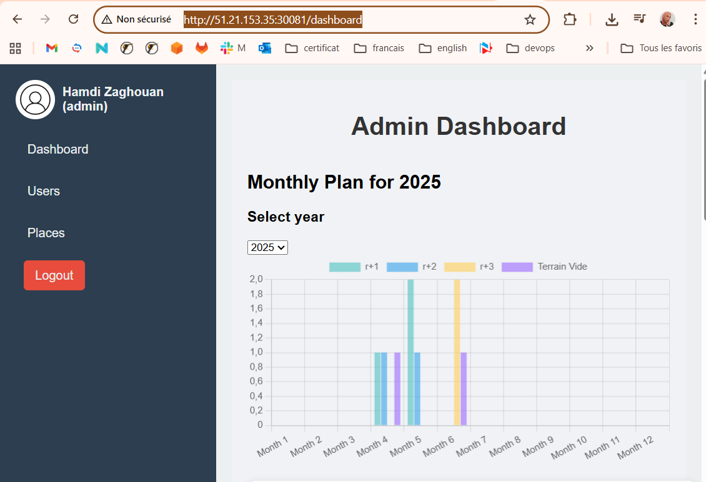
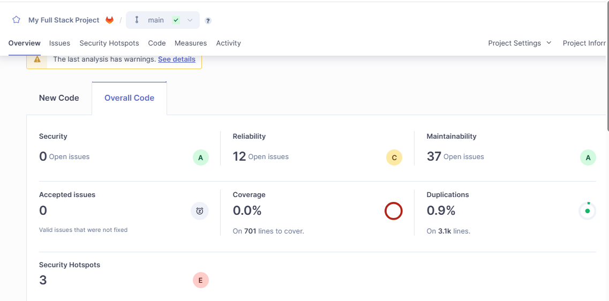
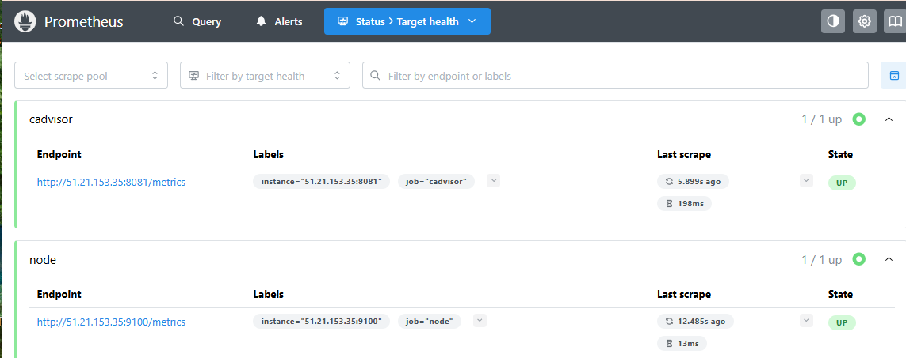

# 🏡 Guest House Management System

## 📌 Description

**Guest House Management System** est une application web permettant de gérer une maison d’hôte via un **dashboard d’administration**.

L’application permet de :

* Gérer les maisons d’hôtes
* Gérer les utilisateurs (clients / admin)
* Gérer les réservations
* Suivre l’état des disponibilités
* Administrer l’application via un dashboard moderne

---

## 🧱 Architecture

Le projet est composé de :

* **Backend** : API REST
* **Dashboard** : Interface d’administration
* **Docker** : Conteneurisation des services
* **Kubernetes (K8s)** : Orchestration des containers
* **CI/CD** : Jenkins Pipeline
* **Sécurité** : Scan des images avec Trivy
* **Qualité** : Analyse du code avec SonarQube
* **Cloud** : AWS ECR pour stocker les images Docker

---

## 🖼️ Aperçu de l’application

Crée un dossier nommé **images** à la racine du projet et ajoute tes captures d’écran dedans.

Structure attendue :

```text
project-root/
 ├── images/
 │   ├── dashboard.png
 │   ├── login.png
 │   └── reservations.png
```

### 🔐 Page Login



### 📊 Dashboard Admin


### 📅 Gestion des Réservations


  ### 📅 SAST : SonarQube



  ### 📅 Trivy


  ### 📅 Amazon ECR


  ### 📅 Kubernetes


  ### 📅 Pipeline jenkins


  ### 📅 Prometheus



  ### 📅 Grafana


---

## ⚙️ Pipeline Jenkins – CI/CD

Ce projet utilise un pipeline Jenkins automatisé pour :

* Cloner le code depuis GitLab
* Analyser la qualité du code avec SonarQube
* Construire les images Docker
* Scanner les vulnérabilités avec Trivy
* Publier les images sur AWS ECR
* Déployer l’application sur Kubernetes
* Envoyer des notifications Slack et Email

---

## 🛡️ Sécurité

Le projet intègre :

* L’analyse de vulnérabilités des images Docker
* Le contrôle de la qualité du code avec SonarQube

---

## ✉️ Notifications

Le pipeline envoie automatiquement :

* Des notifications sur Slack
* Des emails après chaque exécution du pipeline

---

## 👩‍💻 Réalisé par

**Nom :** Asma Abdallah
**Email :** [ab.abdallahasma@gmail.com](mailto:ab.abdallahasma@gmail.com)

---

